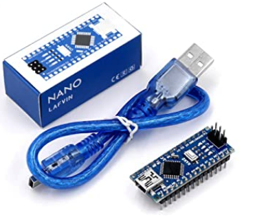
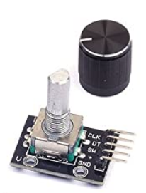
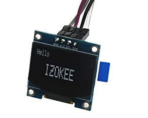
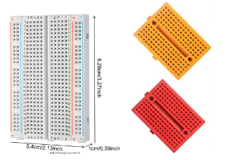

## Materials Required:

- (1) Arduino Nano with mini-USB cable

- (2) rotary encoders with pushbutton

- (1) 1-inch 128x64 pixel display

- (1) medium-sized breadboard and (2) smaller breadboards

- Assorted jumper wires

----------

[Next: Step 1 - Learning about breadboards](./step1.md)