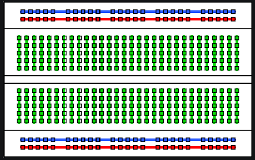

## Step 1: Learn about the breadboard
The breadboard is an easy way to connect electronic components while you’re testing out new ideas. It has regularly spaced holes that most circuit components will fit neatly into.
Inside the breadboard, the holes are connected to each other like this:

On the two outside edges, the holes connect left-to-right, shown by the blue and red lines. Usually, you use the blue row for the electrical negative (-), or ground connections, and the red row for the electrical positive (+) connections.
In the middle, the holes connect up-and-down, shown by the green lines. The holes are not connected across the divider area in the middle.

----------

Previous - [Materials required](./materials.md)

Next - [Step 2: Install the Arduino](./step2.md)
