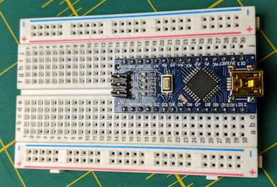
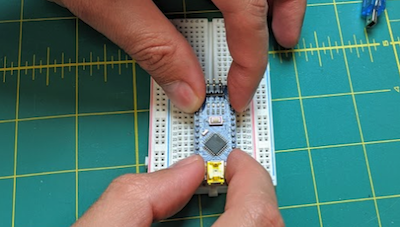
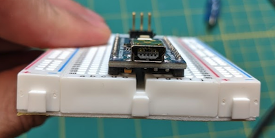

## Step 2: Install the Arduino

Take the Arduino Nano out of its box. Try to avoid touching the pins coming out of the bottom, and only hold it by the sides. Set the Arduino on the larger breadboard, straddling the divide in the middle. Get it as close to the middle as you can (it should have 2 empty rows on one side, and 3 empty rows on the other side).

Using 4 fingers near the corners, push down firmly until the Arduino is fully inserted. Be careful to push evenly, so that all the pins are inserted equally.

Make sure the Arduino is fully inserted. From the end, you should be able to see the black plastic headers below the Arduino touching the breadboard on all sides.

----------

Previous - [Step 1: Learn about the breadboard](./step1.md)

Next - [Step 3: Get your computer ready to program the Arduino](./step3.md)
