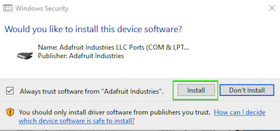
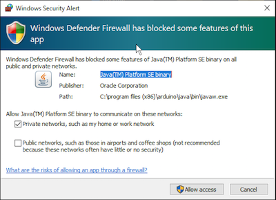
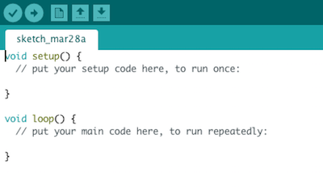

## Step 3: Get your computer ready to program the Arduino

Download the Arduino IDE from this link: 
This can be used on Windows, or Mac computers.

> On Windows, choose the “Windows Installer, for Windows XP and up” version, not the “Windows App” version.

Install the program. If it asks you if you want to install drivers, click “Trust” or “Install”

If Windows asks if you want to allow this program through the firewall, click "Allow Access"

Start the IDE, and from the File menu, choose New Sketch. This is where you will write the code for your game. A new sketch will have some code already included to help you get started. It should look like this:

----------

Previous - [Step 2: Install the Arduino](./step2.md)

Next - [Step 4: Connect the display](./step4.md)
