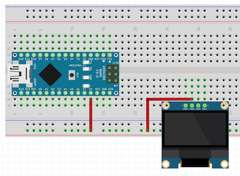

## Step 4: Connect the display

On the other end of the larger breadboard, connect the display, being careful to push it straight in. Look back at the breadboard diagram in Step 1, and make sure that each of the display's pins are on a different green line. We don’t want them connected to each other, otherwise the display won’t work.

> **IMPORTANT**: always make sure the component placement and wiring connections are correct before powering up the Arduino, otherwise you can damage the components, the Arduino, and/or your computer.

Next, we need to supply power to the display. This display can use 3.3 volts (DC) or 5 volts (DC). The Arduino runs on 5V anyway (which it will get from the USB cable), so we’ll use that. First connect a wire from the Arduino pin labeled 5V to the (+) rail on the breadboard. Then connect another wire from the (+) rail to the display pin labeled VCC (2 red wires shown below)

In order for the display to make use of the 5 volts, it needs a path back to the Arduino. This is called the ground path, and the abbreviation on both components is GND. Connect these through the (-) rail on the breadboard like the 2 black wires shown below.

Now that the display can get power, we need to connect some wires to send data (whatever we want to draw) from the Arduino to the screen. We need two wires for this; the first is called the “clock” connection, and connects on the display to the SCK or SCL pin (short for ClocK or CLock). Connect the other end to pin A5 on the Arduino like the blue wire shown below.

The last connection is for the data, on the display’s SDA (serial DAta) pin, and going to the Arduino’s A4 pin like the yellow wire shown below.

----------

Previous - [Step 3: Get your computer ready to program the Arduino](./step3.md)

Next - [Step 5: Power up the Arduino and test the display](./step5.md)
