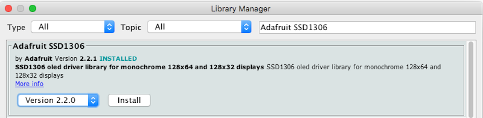

## Step 5: Power up the Arduino and test the display

Plug the USB cable into the Arduino, then into a USB port on your computer. Open the Arduino IDE you downloaded in Step 3, and create a new sketch. To start using the display we just connected, we'll need some code that knows how to convert basic shapes (lines, rectangles, circles, etc.) into pixels on the screen. We'll also need some way to convert the pixels we want to light up into electrical signals that we can transmit over the wires between the Arduino and the display.

Thankfully, we don't need to learn all this stuff on our own, and instead we can just use a "library" of someone else's code to do all the hard parts. We'll just focus on figuring out what we want to draw on the screen.

To import and use a library in the Arduino IDE, go to the Sketch menu, then choose _Include Library > Manage Libraries_

> Note: you need to be connected to the internet for this to work

Type _Adafruit SSD1306_ into the search box, select version 2.2 of the library, and click Install.

This library will convert the pixels we want to turn on and off into electrical signals that will travel over the SCL and SDA wires.

Next, install the _Adafruit GFX Library_, version 1.7.4. This second library will operate together with the SSD1306 library, and will allow us to draw primitive graphics like circles and lines, and display text, without needing to figure out which pixels make up those shapes or letters.

> Note: if either library asks you to install optional or required dependencies, choose "Install All"

----------

Previous - [Step 4: Connect the display](./step4.md)

Next - [Step 6: ](./step6.md)
